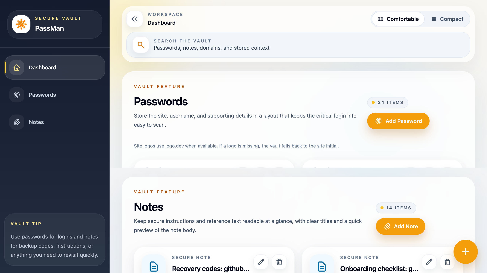
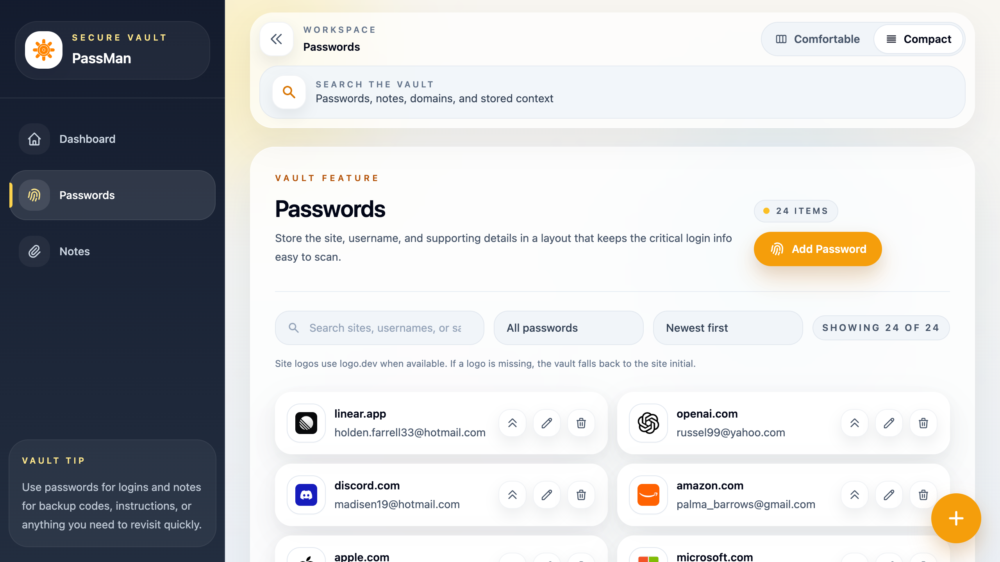
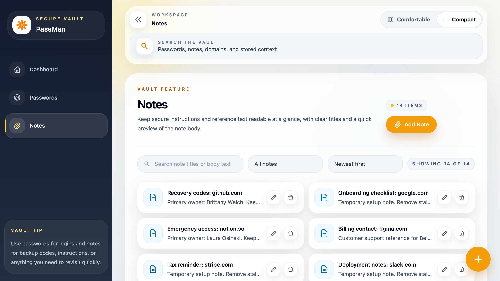
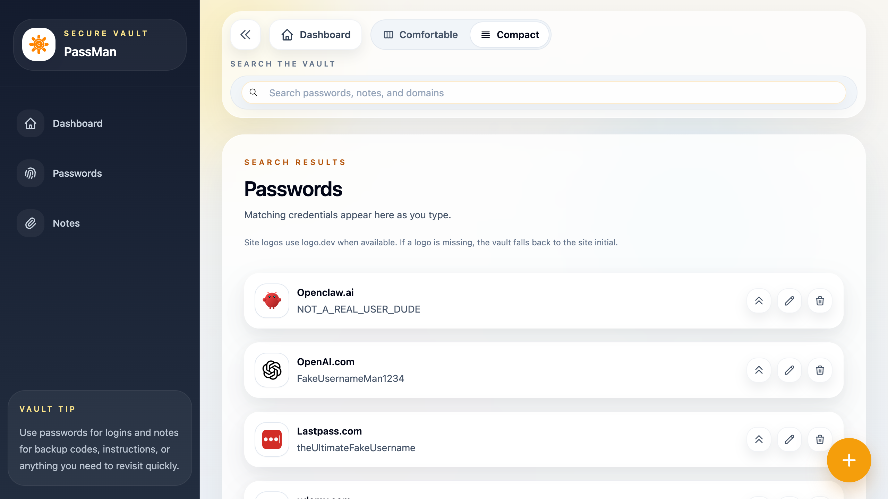

# PassMan Demo

PassMan Demo is a design-focused password vault MVP built with React, Express, MongoDB, React Query, Tailwind CSS, and Algolia. The current UI is tuned around two presentation modes: a comfortable dashboard for showcasing richer cards and hierarchy, and a compact search and collection experience for larger vaults.

## Highlights

- Password and secure note vault with create, edit, delete, and search flows
- Comfortable dashboard cards for portfolio presentation and compact list views for scale
- Route-backed modals for add, edit, and destructive confirmation states
- Deterministic `demo` and `stress` seed modes for portfolio screenshots and scale testing
- Website logos powered by `logo.dev` when available, with graceful fallbacks
- Algolia-backed search with dedicated empty states for no-match queries

## Screenshots

### Comfortable Workspace

The dashboard is the presentation mode: larger cards, stronger hierarchy, and quick access to the core vault actions.



### Password Vault

Passwords use branded logos, semantic actions, and clearer content hierarchy while still supporting denser collection views when the dataset grows.



### Secure Notes

Notes follow the same system with larger reading surfaces, strong titles, and fast edit/delete actions.



### Search At Scale

Search defaults to compact mode so larger result sets stay scannable. When a query returns no results, the UI falls back to dashed empty states instead of leaving large blank panels.



## Local Setup

1. Use Node `20.19.0` and npm `10.8.x`.
2. Install root dependencies:

```bash
npm install
```

3. Install frontend dependencies:

```bash
npm install --prefix frontend
```

4. Add backend env vars in `.env`:

```bash
MONGO_URI=...
```

You can also use the legacy `DB_USER` and `DB_PASS` pair.

## Running The App

Start the backend and frontend together:

```bash
npm run dev
```

The backend defaults to port `5050`.

## Demo Data

Import the smaller curated portfolio dataset:

```bash
npm run data:import:demo
```

Import the larger stress dataset:

```bash
npm run data:import:stress
```

Clear seeded data:

```bash
npm run data:destroy
```

## Verification

Run the current frontend verification flow:

```bash
npm run verify
```

Build the frontend only:

```bash
npm run build:frontend
```

## Stack

- React 18
- React Router 6
- Tailwind CSS
- Headless UI
- React Query
- Express
- MongoDB with Mongoose
- Algolia
- Faker
- zxcvbn
